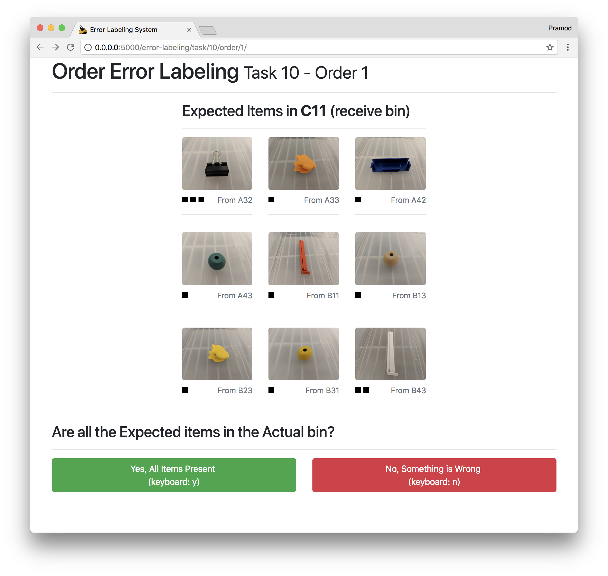

# Order-Picking-Error-Labeling-System
Simple web app to help label correct selection of orders

## Installation

This app is dependent on Python 3.6.

Please clone the repo and choose one of the two options below:

### Option 1: Use Docker Compose

You can use Docker Compose if you don't want to install Python 3.6.

1. `docker-compose up`
2. `open localhost:5000`
3. `docker-compose down`

**Important**: Between methods, you'll need to change the `environment` settings in the `docker-compose.yml` to point to different JSON pick paths. You'll have to bring `down` and bring `up` the system again.

### Option 2: Use your on Python interpreter

If you'd prefer to use your own interpreter, you can follow these steps:

```
virtualenv venv
source venv/bin/activate
pip install -r requirements.txt
python app.py -pp data/RFID-Study-Task-Generation/output/MASTER/tasks-MASTER-training.json -o data/output.log
```

**Important**: Between methods, you'll need to stop the app and change the `-pp` argument in the last command above.

## Updating RFID pick-paths

When the pick paths are versioned up, you'll want to update the `data/RFID-Study-Task-Generation` `git` submodule.

## Example

Check out what one screen in the application looks like:


